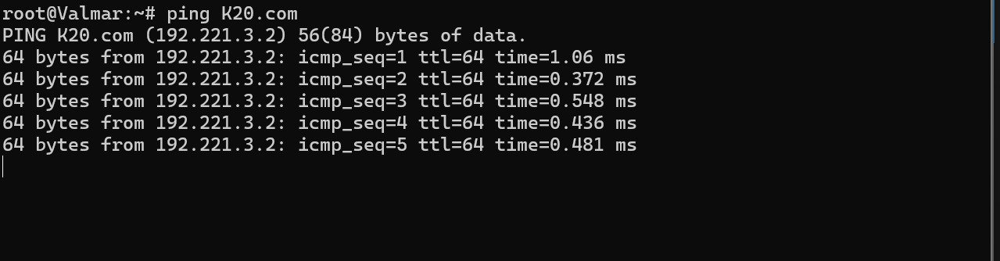
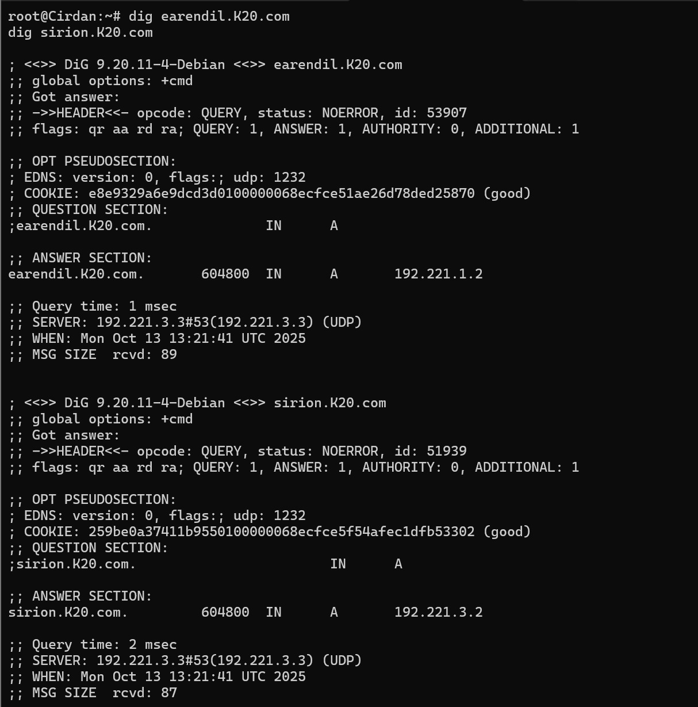
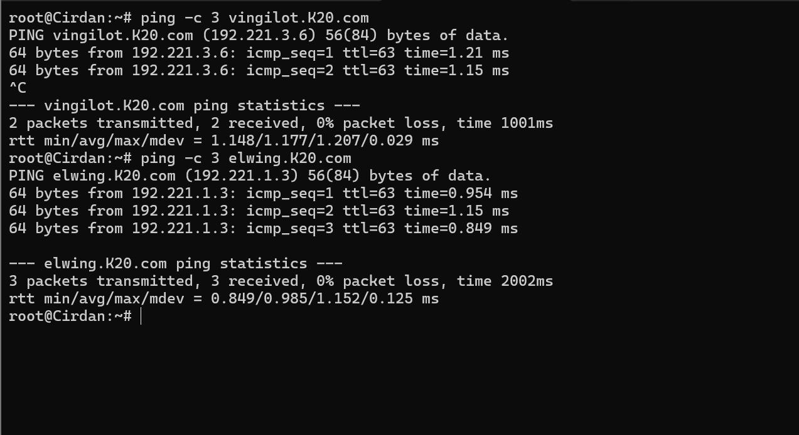
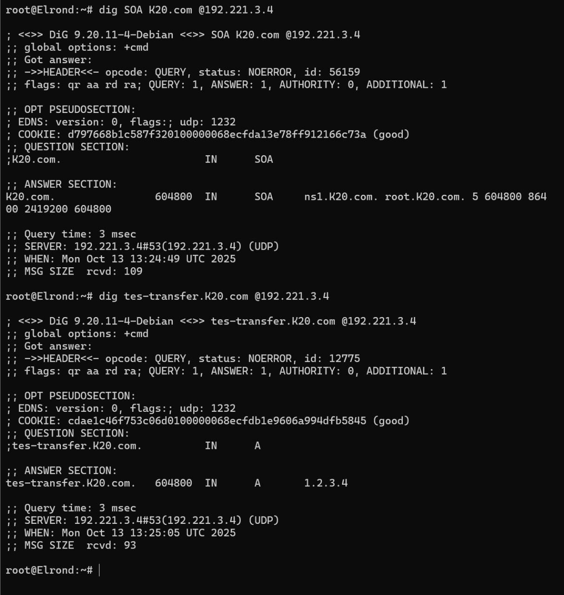
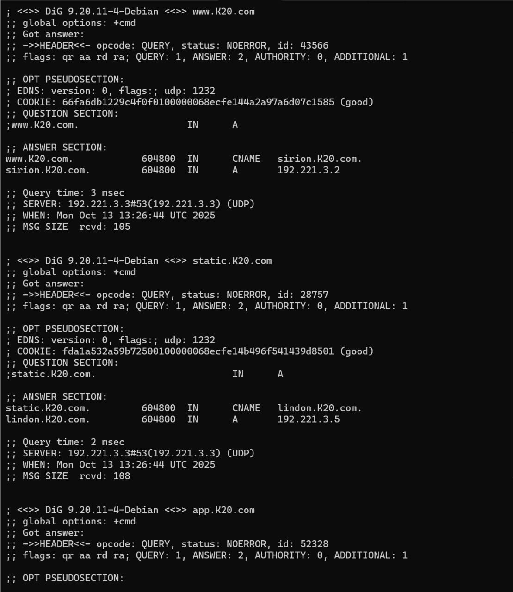
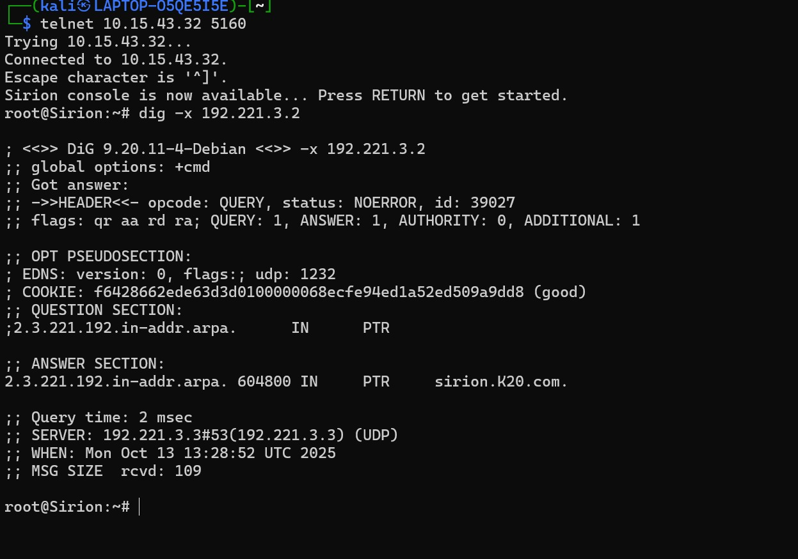
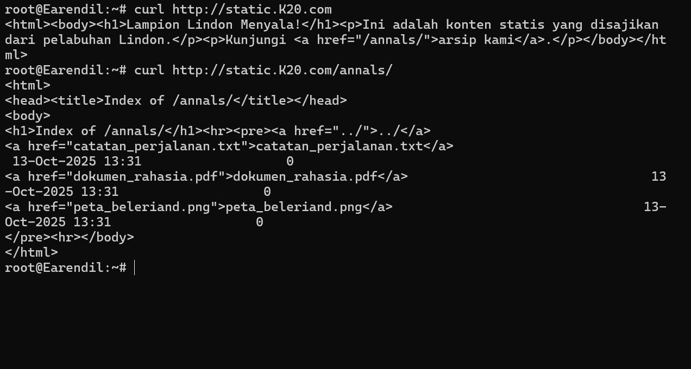
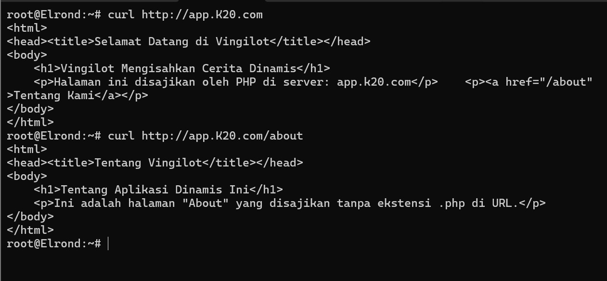
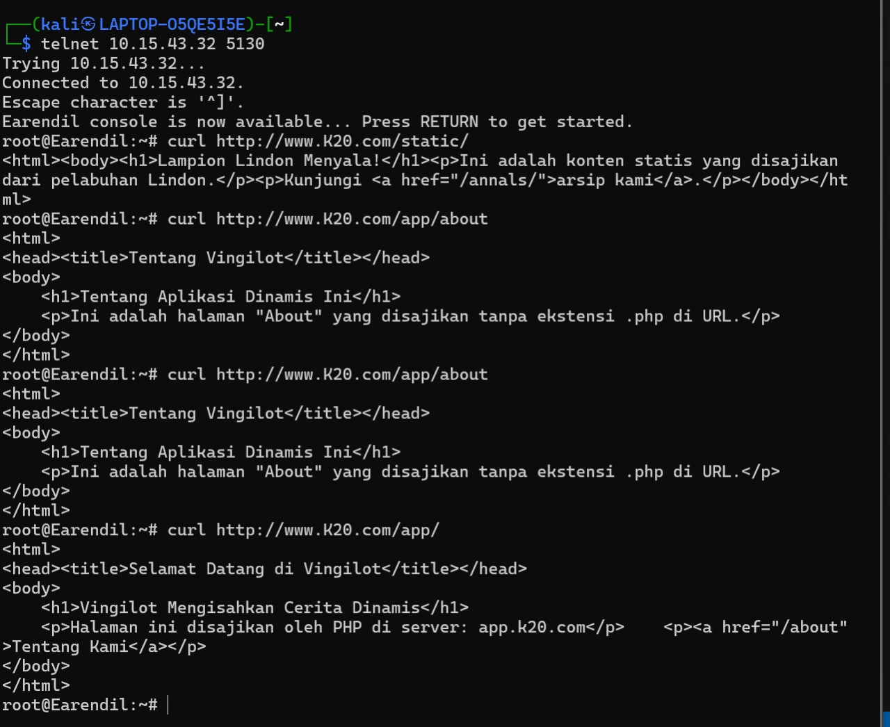

# Jarkom-Modul-2-2025-IT-20
**Laporan Resmi Praktikum Modul 2 — Komunikasi Data & Jaringan Komputer 2025**

## Daftar Anggota

| Nama                  | NRP        |
|-----------------------|------------|
| Zahra Khaalishah      | 5027241070 |
| Dimas Muhammad Putra  | 5027241076 |

---

## Soal 1
Di tepi Beleriand yang porak-poranda, Eonwe merentangkan tiga jalur: Barat untuk 
Earendil dan Elwing, Timur untuk Círdan, Elrond, Maglor, serta pelabuhan DMZ bagi 
Sirion, Tirion, Valmar, Lindon, Vingilot. Tetapkan alamat dan default gateway tiap 
tokoh sesuai glosarium yang sudah diberikan.

Eonwe
```
auto eth0
iface eth0 inet dhcp

auto eth1
iface eth1 inet static
    address 192.221.1.1
    netmask 255.255.255.0

auto eth2
iface eth2 inet static
    address 192.221.2.1
    netmask 255.255.255.0

auto eth3
iface eth3 inet static
    address 192.221.3.1
    netmask 255.255.255.0
```
Earendil
```
auto eth0
iface eth0 inet static
    address 192.221.1.2
    netmask 255.255.255.0
    gateway 192.221.1.1
```
Elwing

```
auto eth0
iface eth0 inet static
    address 192.221.1.3
    netmask 255.255.255.0
    gateway 192.221.1.1
```
Cirdan
```
auto eth0
iface eth0 inet static
    address 192.221.2.2
    netmask 255.255.255.0
    gateway 192.221.2.1
```
Elrond
```
auto eth0
iface eth0 inet static
    address 192.221.2.3
    netmask 255.255.255.0
    gateway 192.221.2.1
```
Maglor
```
auto eth0
iface eth0 inet static
    address 192.221.2.4
    netmask 255.255.255.0
    gateway 192.221.2.1
```
Sirion
```
auto eth0
iface eth0 inet static
    address 192.221.3.2
    netmask 255.255.255.0
    gateway 192.221.3.1
```
Tirion
```
auto eth0
iface eth0 inet static
    address 192.221.3.3
    netmask 255.255.255.0
    gateway 192.221.3.1
```
Valmar
```
auto eth0
iface eth0 inet static
    address 192.221.3.4
    netmask 255.255.255.0
    gateway 192.221.3.1
```
Lindon
```
auto eth0
iface eth0 inet static
    address 192.221.3.5
    netmask 255.255.255.0
    gateway 192.221.3.1
```
Vingilot
```
auto eth0
iface eth0 inet static
    address 192.221.3.6
    netmask 255.255.255.0
    gateway 192.221.3.1
```


## Soal 2
Angin dari luar mulai berhembus ketika Eonwe membuka jalan ke awan NAT. Pastikan 
jalur WAN di router aktif dan NAT meneruskan trafik keluar bagi seluruh alamat internal 
sehingga host di dalam dapat mencapai layanan di luar menggunakan IP address.

```
up apt update && apt install -y iptables
up iptables -t nat -A POSTROUTING -o eth0 -j MASQUERADE -s 192.221.0.0/16
```


## Soal 3
Kabar dari Barat menyapa Timur. Pastikan kelima klien dapat saling berkomunikasi 
lintas jalur (routing internal via Eonwe berfungsi), lalu pastikan setiap host non-router 
menambahkan resolver 192.168.122.1 saat interfacenya aktif agar akses paket dari 
internet tersedia sejak awal. 
```
up echo "nameserver 192.221.3.3" > /etc/resolv.conf && \
```


## Soal 4
Para penjaga nama naik ke menara, di Tirion (ns1/master) bangun zona <xxxx>.com 
sebagai authoritative dengan SOA yang menunjuk ke ns1.<xxxx>.com dan catatan NS 
untuk ns1.<xxxx>.com dan ns2.<xxxx>.com. Buat A record untuk ns1.<xxxx>.com 
dan ns2.<xxxx>.com yang mengarah ke alamat Tirion dan Valmar sesuai glosarium, 
serta A record apex <xxxx>.com yang mengarah ke alamat Sirion (front door), aktifkan 
notify dan allow-transfer ke Valmar, set forwarders ke 192.168.122.1. Di Valmar 
(ns2/slave) tarik zona <xxxx>.com dari Tirion dan pastikan menjawab authoritative. pada seluruh host non-router ubah urutan resolver menjadi IP dari ns1.<xxxx>.com → 
ns2.<xxxx>.com → 192.168.122.1. Verifikasi query ke apex dan hostname layanan 
dalam zona dijawab melalui ns1/ns2. 

```
apt update
apt install bind9 -y
```

Di terminal Tirion
```
nano /etc/bind/named.conf.options

options {
    directory "/var/cache/bind";

    forwarders {
        192.168.122.1;
    };

    recursion yes;

    // TAMBAHKAN BLOK INI:
    allow-recursion {
        localhost;
        192.221.1.0/24; // Izinkan Jalur Barat
        192.221.2.0/24; // Izinkan Jalur Timur
        192.221.3.0/24; // Izinkan Jalur DMZ
    };

    dnssec-validation auto;
    listen-on-v6 { any; };
};
```
Di terminal Tirion
```
nano /etc/bind/named.conf.local

zone "K20.com" {
    type master;
    file "/etc/bind/zones/db.K20.com";    // Lokasi file data zona
    allow-transfer { 192.221.3.4; };      // Izinkan Valmar (IP ns2) untuk menyalin zona
    notify yes;                           // Beri tahu Valmar jika ada pembaruan
};
```

Di terminal Tirion
```
mkdir -p /etc/bind/zones
nano /etc/bind/zones/db.K20.com

$TTL    604800
@       IN      SOA     ns1.K20.com. root.K20.com. (
                              2         ; Serial (PENTING: Naikkan angkanya setiap kali ada perubahan)
                         604800         ; Refresh
                          86400         ; Retry
                        2419200         ; Expire
                         604800 )       ; Negative Cache TTL
;
; Name Servers (NS Records)
@       IN      NS      ns1.K20.com.
@       IN      NS      ns2.K20.com.

; A Records (Pemetaan nama ke IP)
ns1     IN      A       192.221.3.3      ; ns1.K20.com menunjuk ke IP Tirion
ns2     IN      A       192.221.3.4      ; ns2.K20.com menunjuk ke IP Valmar
@       IN      A       192.221.3.2      ; K20.com (apex) menunjuk ke IP Sirion
```

Di terminal Tirion
```
named-checkconf
named-checkzone K20.com /etc/bind/zones/db.K20.com

ln -s /etc/init.d/named /etc/init.d/bind9

service bind9 restart
```
Di terminal Valmar
```
apt update
apt install bind9 -y

nano /etc/bind/named.conf.options

options {
        directory "/var/cache/bind";

    forwarders {
        192.168.122.1;
    };

    recursion yes;

    // TAMBAHKAN BLOK INI:
    allow-recursion {
        localhost;
        192.221.1.0/24; // Izinkan Jalur Barat
        192.221.2.0/24; // Izinkan Jalur Timur
        192.221.3.0/24; // Izinkan Jalur DMZ
    };

    dnssec-validation auto;
    listen-on-v6 { any; };
};

nano /etc/bind/named.conf.local

zone "K20.com" {
    type slave;
    file "slaves/db.K20.com";
    masters { 192.221.3.3; };    // Tentukan IP Master (Tirion)
};
```
Di terminal Valmar
```
named-checkconf
ln -s /etc/init.d/named /etc/init.d/bind9
service bind9 restart
```
Menambahkan di /etc/network/interfaces di semua node
```
up echo "nameserver 192.221.3.3" > /etc/resolv.conf && \
       echo "nameserver 192.221.3.4" >> /etc/resolv.conf && \
       echo "nameserver 192.221.122.1" >> /etc/resolv.conf
```
Untuk mengecek
```
ping K20.com
```
output ketika berhasil



## Soal 5
“Nama memberi arah,” kata Eonwe. Namai semua tokoh (hostname) sesuai glosarium, 
eonwe, earendil, elwing, cirdan, elrond, maglor, sirion, tirion, valmar, lindon, 
vingilot, dan verifikasi bahwa setiap host mengenali dan menggunakan hostname 
tersebut secara system-wide. Buat setiap domain untuk masing masing node sesuai 
dengan namanya (contoh: eru.<xxxx>.com) dan assign IP masing-masing juga. Lakukan 
pengecualian untuk node yang bertanggung jawab atas ns1 dan ns2 
```
echo "eonwe" > /etc/hostname
echo "earendil" > /etc/hostname
echo "elwing" > /etc/hostname
echo "cirdan" > /etc/hostname
echo "elrond" > /etc/hostname
echo "maglor" > /etc/hostname
echo "sirion" > /etc/hostname
echo "tirion" > /etc/hostname
echo "valmar" > /etc/hostname
echo "lindon" > /etc/hostname
echo "vingilot" > /etc/hostname
```
Di Terminal Terion
```
nano /etc/bind/zones/db.K20.com
```
Rubah ini
```
@       IN      SOA     ns1.K20.com. root.K20.com. (
                              4         ; Serial (WAJIB UBAH NOMOR INI!)
                         604800         ; Refresh
...
```
Kemudian Tambahkan
```
earendil  IN      A       192.221.1.2
elwing    IN      A       192.221.1.3

cirdan    IN      A       192.221.2.2
elrond    IN      A       192.221.2.3
maglor    IN      A       192.221.2.4

sirion    IN      A       192.221.3.2
lindon    IN      A       192.221.3.5
vingilot  IN      A       192.221.3.6

; A Records for Router Interfaces
eonwe-barat IN    A       192.221.1.1
eonwe-timur IN    A       192.221.2.1
eonwe-dmz   IN    A       192.221.3.1


named-checkconf
named-checkzone K20.com /etc/bind/zones/db.K20.com

service bind9 restart
```
Cek bebas di semua node
```
dig earendil.K20.com
dig sirion.K20.com

ping -c 3 vingilot.K20.com
ping -c 3 elwing.K20.com
```
output ketika berhasil 


## Soal 6
Lonceng Valmar berdentang mengikuti irama Tirion. Pastikan zone transfer berjalan, 
Pastikan Valmar (ns2) telah menerima salinan zona terbaru dari Tirion (ns1). Nilai 
serial SOA di keduanya harus sama.

1. Cek nomor seri di Tirion (Master).
-    Jalankan dari terminal klien manapun (misal: Elrond).
```
dig SOA K20.com @192.221.3.3
```
2. Cek nomor seri di Valmar (Slave).
-    Jalankan dari terminal klien manapun (misal: Elrond).
```
dig SOA K20.com @192.221.3.4
```

1. Buat perubahan di Tirion.
-    a. Buka file zona di terminal TIRION:
```
nano /etc/bind/zones/db.K20.com
```
-    b. NAIKKAN NOMOR SERI (misal, dari 4 menjadi 5). INI WAJIB.
```
      mengubah record SOA menjadi: 
      5       ; Serial (WAJIB UBAH NOMOR INI!)
      tes-transfer  IN      A       1.2.3.4
```
2. Terapkan perubahan di Tirion.
-    a. Periksa sintaks di terminal TIRION:
```
named-checkconf
named-checkzone K20.com /etc/bind/zones/db.K20.com
```
-    b. Restart BIND9 di terminal TIRION (gunakan perintah yang sesuai):
```
service bind9 restart
```
-    c. Pastikan BIND9 masih berjalan di TIRION:
```
ps aux | grep named
```
3. Verifikasi transfer zona di Valmar (Slave).(bebas di semua node)
```
dig SOA K20.com @192.221.3.4
```
```
    -> Hasilnya harus menunjukkan nomor seri yang baru (misal: 5).
```
-   c. Dari terminal klien, cek record baru di Valmar:
```
dig tes-transfer.K20.com @192.221.3.4
```
    -> Hasilnya harus menunjukkan A record dengan IP 1.2.3.4.
    
output ketika berhasil



## Soal 7
Peta kota dan pelabuhan dilukis. Sirion sebagai gerbang, Lindon sebagai web statis, 
Vingilot sebagai web dinamis. Tambahkan pada zona <xxxx>.com A record untuk 
sirion.<xxxx>.com 
(IP 
Sirion), 
lindon.<xxxx>.com 
vingilot.<xxxx>.com (IP Vingilot). Tetapkan CNAME : - 
www.<xxxx>.com → sirion.<xxxx>.com,  - - 
static.<xxxx>.com → lindon.<xxxx>.com, dan  
app.<xxxx>.com → vingilot.<xxxx>.com.  
(IP 
Lindon), 
dan 
Verifikasi dari dua klien berbeda bahwa seluruh hostname tersebut ter-resolve ke tujuan 
yang benar dan konsisten. 
```
nano /etc/bind/zones/db.K20.com
```
Rubah dengan
```
@       IN      SOA     ns1.K20.com. root.K20.com. (
                              6         ; Serial (WAJIB UBAH NOMOR INI!)
                         604800         ; Refresh
...
```
Tambahkan ini
```
; CNAME Records (Alias untuk layanan)
www       IN      CNAME   sirion.K20.com.
static    IN      CNAME   lindon.K20.com.
app       IN      CNAME   vingilot.K20.com.
```

 Di Terminal Tirion
 ```
named-checkconf
named-checkzone K20.com /etc/bind/zones/db.K20.com

service bind9 restart
```
Di Earendil
```
dig www.K20.com
dig static.K20.com
dig app.K20.com
```

Di Cirdan
```
dig www.K20.com
dig static.K20.com
dig app.K20.com
```
output ketika berhasil



## Soal 8
Setiap jejak harus bisa diikuti. Di Tirion (ns1) deklarasikan satu reverse zone untuk 
segmen DMZ tempat Sirion, Lindon, Vingilot berada. Di Valmar (ns2) tarik reverse zone 
tersebut sebagai slave, isi PTR untuk ketiga hostname itu agar pencarian balik IP 
address mengembalikan hostname yang benar, lalu pastikan query reverse untuk 
alamat Sirion, Lindon, Vingilot dijawab authoritative.

Di Terminal TIRION
```
nano /etc/bind/named.conf.local
```
Tambahkan konfigurasi zona berikut di akhir file named.conf.local
```
// Zona Reverse DNS untuk segmen DMZ (Soal 8)
zone "3.221.192.in-addr.arpa" {
    type master;
    file "/etc/bind/zones/db.192.221.3"; // Nama file untuk data reverse zone
    allow-transfer { 192.221.3.4; };      // Izinkan Valmar untuk menyalin
    notify yes;
};
```
Di terminal TIRION
```
nano /etc/bind/zones/db.192.221.3
```
Tambahkan konfigurasi berikut di dalam file db.192.221.3
```
;
; BIND reverse data file for 192.221.3.0/24
;
$TTL    604800
@       IN      SOA     ns1.K20.com. root.K20.com. (
                              1         ; Serial (Mulai dari 1 untuk zona baru)
                         604800         ; Refresh
                          86400         ; Retry
                        2419200         ; Expire
                         604800 )       ; Negative Cache TTL
;
; Name Servers
@       IN      NS      ns1.K20.com.
@       IN      NS      ns2.K20.com.

; PTR Records (IP -> Hostname)
2       IN      PTR     sirion.K20.com.   ; 192.221.3.2
5       IN      PTR     lindon.K20.com.   ; 192.221.3.5
6       IN      PTR     vingilot.K20.com. ; 192.221.3.6
```
Di Terminal TIRION
```
named-checkconf
named-checkzone 3.221.192.in-addr.arpa /etc/bind/zones/db.192.221.3

service bind9 restart
```
Di Terminal VALMAR
```
nano /etc/bind/named.conf.local
```
Tambahkan konfigurasi zona berikut di akhir file named.conf.local
```
zone "3.221.192.in-addr.arpa" {
    type slave;
    file "slaves/db.192.221.3";
    masters { 192.221.3.3; };
};
```
Di Terminal VALMAR
```
named-checkconf
service bind9 restart
```
Verifikasi lookup reverse untu sirion
```
dig -x 192.221.3.2
```
Hasil Yang diharapkan
```
;; ->>HEADER<<- opcode: QUERY, status: NOERROR, id: ...
;; flags: qr aa rd ra; ...  <-- Perhatikan flag 'aa' (Authoritative)

;; QUESTION SECTION:
;2.3.221.192.in-addr.arpa.      IN      PTR

;; ANSWER SECTION:
2.3.221.192.in-addr.arpa. 604800 IN     PTR     sirion.K20.com. 


#verifikasi lookup reverse untu lindon
dig -x 192.221.3.5

#verifikasi lookup reverse untu vingilot
dig -x 192.221.3.6
```
output ketika berhasil



## Soal 9
Lampion Lindon dinyalakan. Jalankan web statis pada hostname static.<xxxx>.com 
dan buka folder arsip /annals/ dengan autoindex (directory listing) sehingga isinya 
dapat ditelusuri. Akses harus dilakukan melalui hostname, bukan IP. 
```
apt update && apt-get install -y nginx
```
Di terminal LINDON
- Buat direktori utama untuk situs
```
mkdir -p /var/www/static.K20.com
```
Buat halaman utama (index.html)
```
echo '<html><body><h1>Lampion Lindon Menyala!</h1><p>Ini adalah konten statis yang disajikan dari pelabuhan Lindon.</p><p>Kunjungi <a href="/annals/">arsip kami</a>.</p></body></html>' > /var/www/static.K20.com/index.html
```
Buat direktori arsip /annals/
```
mkdir -p /var/www/static.K20.com/annals
```
Buat beberapa file contoh di dalam /annals/ agar ada isinya
```
touch /var/www/static.K20.com/annals/catatan_perjalanan.txt
touch /var/www/static.K20.com/annals/peta_beleriand.png
touch /var/www/static.K20.com/annals/dokumen_rahasia.pdf
```
Di terminal LINDON
```
nano /etc/nginx/sites-available/static.K20.com
```
Konfigurasi Nginx untuk static.K20.com
```
server {
    listen 80;
    server_name static.K20.com;

    # Tentukan direktori root tempat file website disimpan
    root /var/www/static.K20.com;
    index index.html;

    # Konfigurasi standar untuk menangani request
    location / {
        try_files $uri $uri/ =404;
    }

    # Konfigurasi khusus untuk folder /annals/
    location /annals/ {
        # AKTIFKAN AUTOINDEX (DIRECTORY LISTING) DI SINI
        autoindex on;
    }
}
```
Di terminal LINDON
- Buat symbolic link untuk mengaktifkan konfigurasi situs
```
ln -s /etc/nginx/sites-available/static.K20.com /etc/nginx/sites-enabled/
```
Hapus link konfigurasi default agar tidak terjadi konflik
```
rm /etc/nginx/sites-enabled/default
```
Periksa apakah konfigurasi Nginx bebas dari kesalahan sintaks
```
nginx -t
```
Restart layanan Nginx menggunakan perintah yang sesuai untuk sistem Anda
```
/etc/init.d/nginx restart
```
Pastikan proses Nginx sedang berjalan
```
ps aux | grep nginx
```
cek di client manapun(misal: Earendil)
```
curl http://static.K20.com
```
-  outputnya harusnya <html><body><h1>Lampion Lindon Menyala!</h1><p>Ini adalah konten statis yang disajikan dari pelabuhan Lindon.</p><p>Kunjungi <a href="/annals/">arsip kami</a>.</p></body></html>

Dari terminal Earendil
```
curl http://static.K20.com/annals/
```
-  outputnya harusnya Index of /annals/

output ketika berhasil



## Soal 10
Vingilot mengisahkan cerita dinamis. Jalankan web dinamis (PHP-FPM) pada 
hostname app.<xxxx>.com dengan beranda dan halaman about, serta terapkan rewrite 
sehingga /about berfungsi tanpa akhiran .php. Akses harus dilakukan melalui hostname. 

Di terminal vingilot
```
apt update
apt-get install -y nginx php8.4-fpm

mkdir -p /var/www/app.K20.com

echo '<html>
<head><title>Selamat Datang di Vingilot</title></head>
<body>
    <h1>Vingilot Mengisahkan Cerita Dinamis</h1>
    <?php
        echo "<p>Halaman ini disajikan oleh PHP di server: " . $_SERVER["SERVER_NAME"] . "</p>";
    ?>
    <p><a href="/about">Tentang Kami</a></p>
</body>
</html>' > /var/www/app.K20.com/index.php

echo '<html>
<head><title>Tentang Vingilot</title></head>
<body>
    <h1>Tentang Aplikasi Dinamis Ini</h1>
    <p>Ini adalah halaman "About" yang disajikan tanpa ekstensi .php di URL.</p>
</body>
</html>' > /var/www/app.K20.com/about.php
```

Berikan kepemilikan seluruh direktori web ke pengguna www-data
```
chown -R www-data:www-data /var/www/app.K20.com
```
Atur izin direktori ke 755 dan file ke 644
```
find /var/www/app.K20.com -type d -exec chmod 755 {} \;
find /var/www/app.K20.com -type f -exec chmod 644 {} \;

nano /etc/nginx/sites-available/app.K20.com
```
- Konfigurasi Nginx untuk app.K20.com
- Konfigurasi Nginx untuk app.K20.com (PHP-FPM)
```
server {
    listen 80;
    server_name app.K20.com;

    root /var/www/app.K20.com;
    index index.php;

    location / {
        # Aturan rewrite yang memungkinkan /about berfungsi
        try_files $uri $uri/ $uri.php =404;
    }

    # Teruskan semua file .php ke PHP-FPM untuk diproses
    location ~ \.php$ {
        include snippets/fastcgi-php.conf;
        # Pastikan path socket ini benar untuk versi PHP 8.4
        fastcgi_pass unix:/var/run/php/php8.4-fpm.sock;
    }
}

ln -s /etc/nginx/sites-available/app.K20.com /etc/nginx/sites-enabled/
```
Hapus link konfigurasi default
```
rm -f /etc/nginx/sites-enabled/default

nginx -t

/etc/init.d/nginx restart
/etc/init.d/php8.4-fpm restart
```
Memastikan proses nginx dan php-fpm berjalan
```
ps aux | grep nginx
ps aux | grep php-fpm

ls -l /var/run/php/
```
Cek di client manapun(misal: Elrond)
```
curl http://app.K20.com
```
Outputnya harusnya <html>
```
curl http://app.K20.com/about
```
- Outputnya harusnya about.php



## Soal 11
Di muara sungai, Sirion berdiri sebagai reverse proxy. Terapkan path-based routing: 
/static → Lindon dan /app → Vingilot, sambil meneruskan header Host dan X-Real-IP 
ke backend. Pastikan Sirion menerima www.<xxxx>.com (kanonik) dan 
sirion.<xxxx>.com, dan bahwa konten pada /static dan /app di-serve melalui backend 
yang tepat. 

```
apt update && apt-get install -y nginx
```
Di terminal SIRION
```
nano /etc/nginx/sites-available/reverse-proxy.conf
```
Konfigurasi Nginx untuk Sirion sebagai Reverse Proxy
```
server {
    listen 80;

    # Sirion akan merespons kedua hostname ini
    server_name www.K20.com sirion.K20.com;

    # LOKASI 1: Path-based routing untuk konten statis
    # Semua request yang dimulai dengan /static/ akan diteruskan ke Lindon
    location /static/ {
        # Alamat backend server Lindon
        proxy_pass http://192.221.3.5/;

        # Meneruskan header penting ke backend
        proxy_set_header Host $host;
        proxy_set_header X-Real-IP $remote_addr;
        proxy_set_header X-Forwarded-For $proxy_add_x_forwarded_for;
        proxy_set_header X-Forwarded-Proto $scheme;
    }

    # LOKASI 2: Path-based routing untuk konten dinamis
    # Semua request yang dimulai dengan /app/ akan diteruskan ke Vingilot
    location /app/ {
        # Alamat backend server Vingilot
        proxy_pass http://192.221.3.6/;
        
        # Meneruskan header penting ke backend
        proxy_set_header Host $host;
        proxy_set_header X-Real-IP $remote_addr;
        proxy_set_header X-Forwarded-For $proxy_add_x_forwarded_for;
        proxy_set_header X-Forwarded-Proto $scheme;
    }
}
```
Di terminal SIRION
- Buat symbolic link untuk mengaktifkan konfigurasi
```
ln -s /etc/nginx/sites-available/reverse-proxy.conf /etc/nginx/sites-enabled/
```
Hapus link konfigurasi default jika ada
```
rm -f /etc/nginx/sites-enabled/default
```
Periksa apakah konfigurasi Nginx bebas dari kesalahan sintaks
```
nginx -t
```
Restart layanan Nginx
```
/etc/init.d/nginx restart
```
Pastikan proses Nginx sedang berjalan
```
ps aux | grep nginx
```
Cek di client manapun(misal: Earendil)
```
curl http://www.K20.com/static/
```
Dari terminal Earendil
```
curl http://www.K20.com/app/about
```
Dari terminal Earendil
```
curl http://www.K20.com/app/
```
output ketika berhasil


